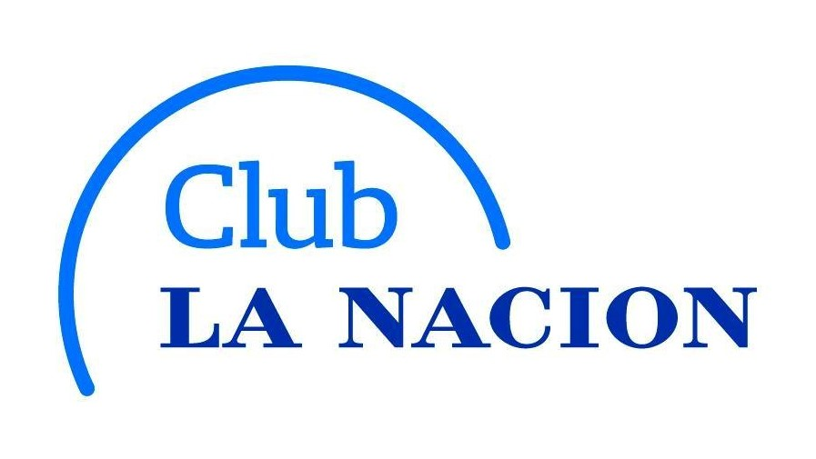

# Club La Nación

<p align="center"><a href="https://club-la-nacion-bertini.netlify.app/" target="_blank" ></a></p>

## Iniciar Proyecto

Primero, ejecute el servidor de desarrollo:

```bash
npm install
# o
yarn install
```

Luego debemos ejecutar el comando tsc para generar la carpeta dist y por ultimo el comando de node para iniciar el servidor

```bash
tsc
node dist/app.js
```

## Descripcion

Este proyecto de backend fue solicitado por personal del sector desarrollo de "La Nacion" por medio de mi trabajo en ITR como desarrollador fullstack.

El proyecto esta desarrollado con NodeJS, Express y TypeScript

## Endpoints
localhost:8080/api/accounts/tourism
localhost:8080/api/accounts/active-flag

### Desarrollador

Nicolás Bertini Argañaras
[https://club-la-nacion-bertini.netlify.app/]
